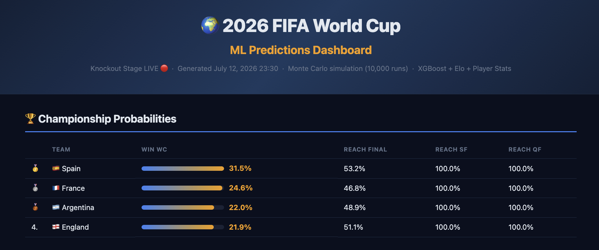
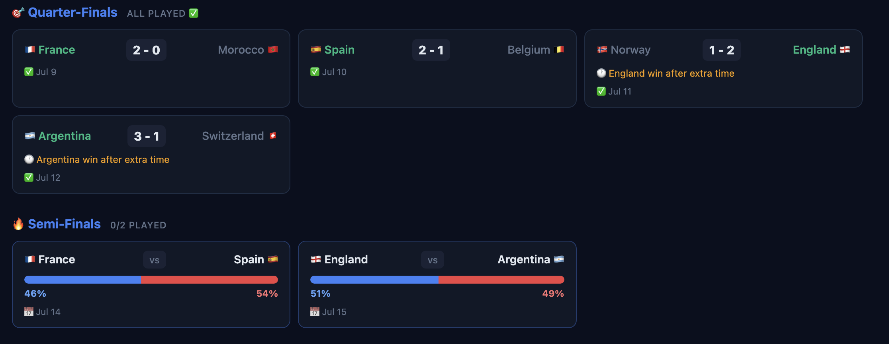
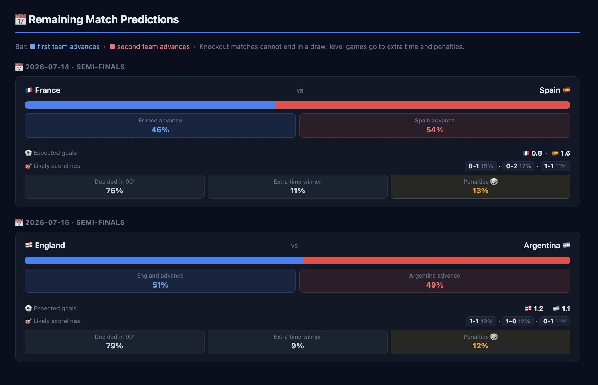

# 🌍 2026 FIFA World Cup — ML Predictions

A machine learning system that predicts the entire 2026 FIFA World Cup. It trains on 150+ years of international football history, auto-fetches real results from the ESPN API as the tournament unfolds, simulates the remaining bracket 10,000 times, and generates a live HTML dashboard with championship probabilities, per-match predictions, and the real knockout bracket.



---

## What it does

- **Match prediction:** XGBoost classifier trained on 50,000+ historical matches predicts Win / Draw / Loss probabilities for any matchup
- **Live results:** every run auto-fetches the latest 2026 WC scores from the ESPN API and recalibrates Elo ratings and goal averages
- **Bracket-aware simulation:** once the group stage ends, Monte Carlo runs are conditioned on the real bracket: actual standings, actual knockout winners, and only the remaining matches simulated. Eliminated teams show 0%
- **Per-match predictions:** for every remaining match, expected goals per team, the most likely scorelines, and how it ends (decided in 90 minutes, extra time, or penalties)
- **Player-aware:** FIFA ratings and market values for all 48 squads adjust expected goals, so squad depth and star players matter
- **Scenario analysis:** simulate injuries, formation changes, or player removals and instantly see the probability impact
- **Explainability:** SHAP shows which features drove each prediction, and why wrong predictions were wrong
- **HTML dashboard:** self-contained visual report with flags, probability bars, the live bracket, and match prediction panels

### The live knockout bracket

Real results fill in as they happen, including extra time and penalty outcomes. Unplayed matches show live advance probabilities.



### Per-match prediction panels

Each remaining match gets expected goals, likely scorelines, and the probability it goes to extra time or penalties. All computed analytically from the Poisson scoreline matrix: P(extra time) is the matrix diagonal, extra time is a mini Poisson match at 30% of each team's scoring rate, and penalties are modeled as a near coin flip because real shootouts are close to random.



---

## Tech stack

| Component | What it does |
|---|---|
| XGBoost | Predicts Win / Draw / Loss per match from 14 engineered features |
| Poisson model | Simulates realistic scorelines from expected goals (λ) |
| Monte Carlo | Runs 10,000 full tournament simulations for stable probabilities |
| Elo ratings | Computed from scratch from 1872 — the anchor signal for all predictions |
| SHAP | Explains which features drove each prediction |
| Python + pandas | Data pipeline, feature engineering, output generation |

---

## Project structure

```
ML World Cup Predictions/
├── data/
│   ├── download_data.py        ← Downloads results.csv + writes 2026 WC fixtures
│   ├── download_players.py     ← Embeds 26-man squads for all 48 teams
│   ├── raw/                    ← results.csv, wc2026_fixtures.json
│   ├── processed/              ← match_features.csv, team_stats.json, Elo ratings
│   ├── live/                   ← real_results.json (fed in during tournament)
│   └── players/                ← wc2026_squads.json
├── features/
│   ├── engineering.py          ← Elo ratings + 14 match features from results.csv
│   └── player_features.py      ← Squad data → attack/midfield/defense scores (0–100)
├── models/
│   ├── match_predictor.py      ← XGBoost: Win/Draw/Loss classifier
│   ├── goal_model.py           ← Poisson: scoreline simulation
│   ├── simulator.py            ← Monte Carlo: 10,000 tournament runs
│   └── lineup_simulator.py     ← Scenario simulator: injuries, formations
├── analysis/
│   └── explainability.py       ← SHAP values + post-match analysis
├── utils/
│   └── flags.py                ← Emoji flags for all 48 teams
├── outputs/
│   ├── report_generator.py     ← Generates the HTML dashboard
│   └── wc2026_predictions.html ← Open this in any browser
└── main.py                     ← Full pipeline runner
```

---

## Setup

```bash
# 1. Clone and install dependencies
git clone https://github.com/your-username/wc2026-ml-predictions.git
cd wc2026-ml-predictions
pip install -r requirements.txt

# macOS only — required for XGBoost
brew install libomp
```

---

## Run the full pipeline

```bash
# Step 1 — Download 50,000+ historical match results + 2026 WC fixtures
python3 data/download_data.py

# Step 2 — Download 26-man squads for all 48 teams
python3 data/download_players.py

# Step 3 — Build Elo ratings + match features (processes 1872–2026)
python3 features/engineering.py

# Step 4 — Build player strength scores (attack / midfield / defense)
python3 features/player_features.py

# Step 5 — Train XGBoost match predictor
python3 models/match_predictor.py

# Step 6 — Run 10,000 Monte Carlo tournament simulations
python3 models/simulator.py

# Step 7 — Generate the HTML dashboard
python3 outputs/report_generator.py
# → open outputs/wc2026_predictions.html in any browser
```

---

## During the tournament

No manual result entry needed. The simulator fetches all new results from the ESPN API on startup, recalibrates, and re-simulates:

```bash
python3 models/simulator.py
python3 outputs/report_generator.py
```

To fully automate it, schedule those two commands daily. On macOS this repo uses a launchd job that runs `scripts/daily_refresh.sh` every morning at 9:00 AM and logs to `logs/refresh.log` (see the script for the plist details). On Linux, a cron entry does the same:

```cron
0 9 * * * cd /path/to/repo && python3 models/simulator.py && python3 outputs/report_generator.py
```

---

## Scenario analysis

```bash
# What if Mbappé gets injured?
python3 models/lineup_simulator.py --injury "France" "Kylian Mbappé"

# What if Germany plays 3-4-3?
python3 models/lineup_simulator.py --formation "Germany" "3-4-3"

# Player value breakdown for the top 5 teams
python3 models/lineup_simulator.py --top5

# Compare England with and without Bellingham
python3 models/lineup_simulator.py --compare "England" "Jude Bellingham"
```

---

## Single match prediction

```bash
python3 main.py --predict "Argentina" "France"
```

---

## How it works

### Elo ratings
Every team's strength is computed from scratch by replaying all 50,000+ matches from 1872 to today. Each match updates both teams' ratings based on the result vs expectation, with K-factors that scale by tournament prestige (World Cup > friendly).

### XGBoost match predictor
Trained on 14 features: Elo difference, home advantage, recent form (last 5/10 games), head-to-head record, goals scored/conceded, and xG proxies. An 80/20 time-based split ensures it's tested on recent matches, not random ones.

### Player strength engine
Each team's 26-man squad is scored 0–100 across attack, midfield, and defense using 60% FIFA rating + 40% market value. These scores adjust expected goals in the simulator by ±40% max, so Elo remains the anchor but squad quality fine-tunes the result.

### Monte Carlo simulation
The full 2026 WC bracket (12 groups → best 32 → knockout) is simulated 10,000 times. Known results are pre-seeded. Championship probability = fraction of simulations a team wins.

### 2026 WC format
48 teams, 12 groups of 4. Top 2 from each group (24 teams) + best 8 third-place teams = 32 teams in the Round of 32. Knockout rounds: R32 → R16 → QF → SF → Final.

---

## Data sources

| Dataset | Source |
|---|---|
| Historical results (1872–2026) | [martj42/international_results](https://github.com/martj42/international_results) |
| Player squads | Embedded in `data/download_players.py` (FIFA 25 ratings + Transfermarkt values) |
| 2026 WC fixtures | Embedded in `data/download_data.py` (Groups A–L, 72 matches) |

---

## Requirements

- Python 3.9+
- See `requirements.txt` for full list (XGBoost, pandas, numpy, scikit-learn, shap, joblib, matplotlib)
